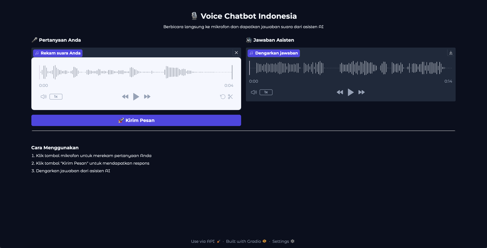

# Voice Chatbot UAS – STT, Gemini LLM, TTS Integration

## 👨‍💻 Pengembang
**Cut Sula Fhatia Rahma (2208107010048)**

Proyek UAS ini merupakan aplikasi chatbot berbasis suara yang memungkinkan pengguna berbicara langsung melalui antarmuka web. Sistem akan mengenali suara pengguna, mengubahnya menjadi teks (Speech-to-Text), memprosesnya menggunakan model bahasa besar (Gemini API), lalu mengubah hasil jawabannya kembali menjadi suara (Text-to-Speech).

## 📌 Fitur Utama
- 🎙️ Speech-to-Text (STT) menggunakan `whisper.cpp` dari OpenAI.
- 🧠 LLM Integration menggunakan Google Gemini API untuk menghasilkan respons dalam Bahasa Indonesia.
- 🔊 Text-to-Speech (TTS) menggunakan model Coqui TTS (Indonesian TTS).
- 🧪 Antarmuka pengguna interaktif berbasis `Gradio` untuk pengujian langsung dari browser.

## 🗂️ Struktur Proyek
```
2208107010048_CutSulaFhatiaRahma_UAS_NLP/
│
├── app/
│   ├── main.py            # Endpoint utama FastAPI
│   ├── llm.py             # Integrasi Gemini API
│   ├── stt.py             # Transkripsi suara (whisper.cpp)
│   ├── tts.py             # TTS dengan Coqui
│   └── whisper.cpp/       # Hasil clone whisper.cpp
│   └── coqui_utils/       # Model dan config Coqui TTS
│
├── gradio_app/
│   └── app.py             # Frontend dengan Gradio
│
├── .env                   # Menyimpan Gemini API Key
├── requirements.txt       # Daftar dependensi Python
└── speakers.pth
```

## ⚙️ Instalasi dan Menjalankan Proyek

### 1. Kloning repository

```bash
git clone https://github.com/csulafr/2208107010048_CutSulaFhatiaRahma_UAS_NLP.git
cd 2208107010048_CutSulaFhatiaRahma_UAS_NLP
````

### 2. Setup dan jalankan Backend (FastAPI)

```bash
# Buat dan aktifkan environment
python3.10 -m venv env
source env/bin/activate   # Linux/macOS
env\Scripts\activate      # Windows

# Install dependencies
pip install -r requirements.txt

# Jalankan server
uvicorn app.main:app --reload 

# Jalankan aplikasi
cd gradio_app
python app.py
```

## 📚 Catatan
- Semua file audio menggunakan format `.wav`.
- Untuk menghasilkan fonem seperti `dəˈnɡan`, teks dari Gemini harus dikonversi ke fonetik.
- Disarankan menggunakan model Whisper: `ggml-large-v3-turbo`.
- Gunakan speaker: `wibowo` dari model Coqui v1.2.

## 📋 Hasil dan Tampilan Frontend
